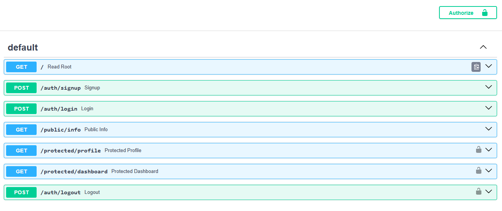
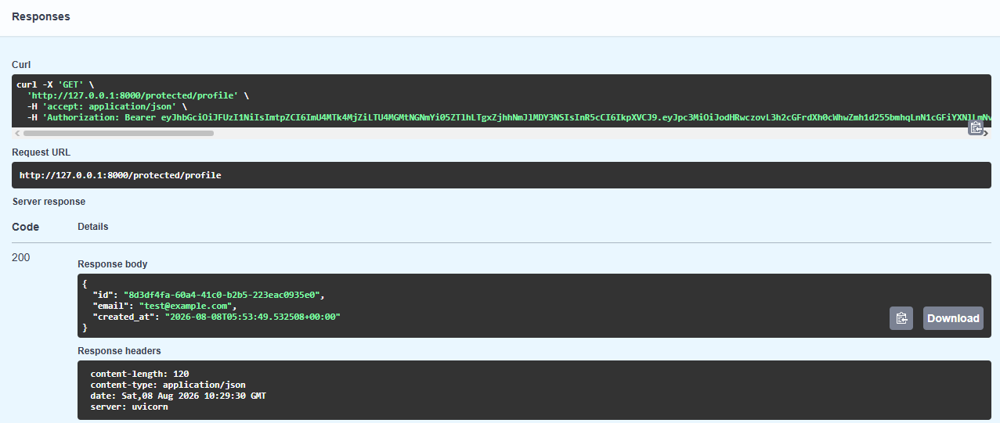
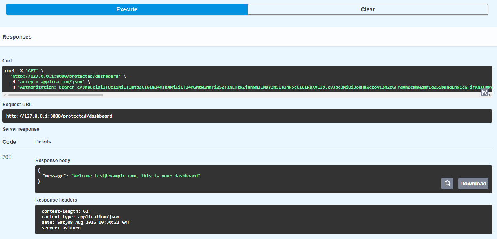
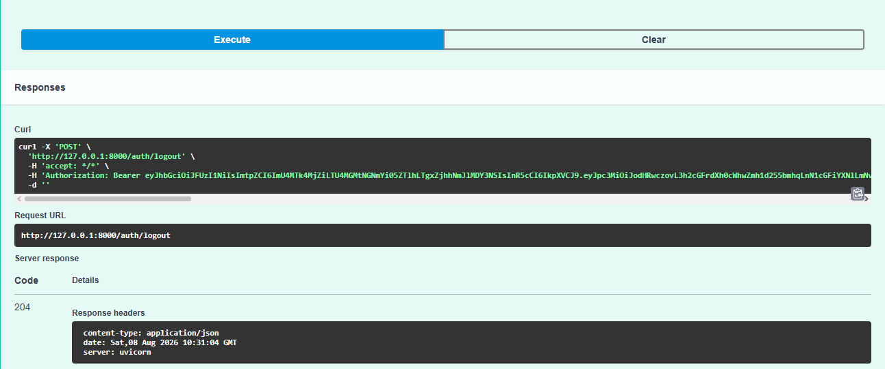

# Secure API with Supabase Auth

A secure RESTful API built with **FastAPI** and **Supabase Auth** that handles user authentication – sign up, log in, log out – and protects routes using **JSON Web Token (JWT)** verification.

This project was built as part of the **FlyRank AI Backend Internship – Week 4** assignment.

---

## ✨ Features

- ✅ **User Signup** – Create a new account with email and password.
- ✅ **User Login** – Authenticate and receive an access token (JWT).
- ✅ **User Logout** – End the user session.
- ✅ **Public Routes** – Open endpoints anyone can access.
- ✅ **Protected Routes** – Routes that require a valid JWT (Bearer token).
- ✅ **Token Verification** – All protected routes verify the token with Supabase.
- ✅ **Reusable Auth Guard** – A single dependency/middleware protects multiple routes.
- ✅ **Swagger UI** – Interactive API docs with an "Authorize" button for Bearer tokens.

---

## 🛠️ Tech Stack

- **Python** 3.10+
- **FastAPI** – Web framework
- **Supabase** – Identity Provider (authentication & token issuer)
- **PyJWT** / **Supabase SDK** – Token handling and verification
- **python-dotenv** – Environment variable management
- **Uvicorn** – ASGI server
- **Swagger UI** – Built-in interactive API documentation

---

## 📋 Prerequisites

- **Python 3.10+** installed ([python.org](https://python.org))
- **Supabase account** (free) – [supabase.com](https://supabase.com)
- **Git** (for version control)
- A **GitHub account** (for submission)

---

## 🔧 Setup & Environment Variables

### 1. Clone the repository

```bash
git clone https://github.com/your-username/auth-api-supabase.git
cd auth-api-supabase
```

### 2. Create a virtual environment (recommended)

```bash
python -m venv venv
source venv/bin/activate      # On Windows: venv\Scripts\activate
```

### 3. Install dependencies

```bash
pip install -r requirements.txt
```

### 4. Create your Supabase project

1. Go to [supabase.com](https://supabase.com) and sign up (free).
2. Click **"New project"** and give it a name (e.g., `auth-practice`).
3. Wait for the project to provision (a few minutes).
4. In the dashboard, go to **Settings → API**.
5. Copy:
   - **Project URL** (e.g., `https://xxxxx.supabase.co`)
   - **`anon` public key** (starts with `eyJ...`)
6. In **Authentication → Providers → Email**, **disable "Confirm email"** for testing.

### 5. Set up environment variables

Create a `.env` file in the project root:

```env
SUPABASE_URL=https://your-project-id.supabase.co
SUPABASE_KEY=your-anon-key
PORT=8000
```

> ⚠️ **Never commit `.env` to GitHub** – it contains your live credentials.

---

## 🚀 Running the API

Start the server:

```bash
uvicorn main:app --reload
```

The API will be available at:

- **http://localhost:8000**
- **Interactive Swagger UI:** http://localhost:8000/docs

---

## 📋 API Endpoints

| Method | Path | Description | Auth Required |
|--------|------|-------------|---------------|
| **POST** | `/auth/signup` | Create a new user account | ❌ No |
| **POST** | `/auth/login` | Authenticate and receive an access token | ❌ No |
| **POST** | `/auth/logout` | End the user session | ✅ Yes (Bearer) |
| **GET** | `/public/info` | Public information (open to all) | ❌ No |
| **GET** | `/protected/profile` | Get current user's profile | ✅ Yes (Bearer) |
| **GET** | `/protected/dashboard` | A protected dashboard (example) | ✅ Yes (Bearer) |

---

## 🧪 Example Usage (curl)

### 1. Sign up a new user

```bash
curl.exe -X POST http://localhost:8000/auth/signup \
  -H "Content-Type: application/json" \
  -d "{\"email\":\"test@example.com\",\"password\":\"password123\"}"
```

**Expected response (201 Created):**

```json
{
  "user": {
    "id": "abc-123-def",
    "email": "test@example.com",
    "created_at": "2025-01-01T00:00:00Z"
  }
}
```

---

### 2. Log in and get an access token

```bash
curl.exe -X POST http://localhost:8000/auth/login \
  -H "Content-Type: application/json" \
  -d "{\"email\":\"test@example.com\",\"password\":\"password123\"}"
```

**Expected response (200 OK):**

```json
{
  "access_token": "eyJhbGciOiJIUzI1NiIs...",
  "refresh_token": "eyJhbGciOiJIUzI1NiIs...",
  "user": {
    "id": "abc-123-def",
    "email": "test@example.com"
  }
}
```

Save the `access_token` for the next step.

---

### 3. Access a protected route

```bash
curl.exe -H "Authorization: Bearer <YOUR_ACCESS_TOKEN>" \
  http://localhost:8000/protected/profile
```

**Expected response (200 OK):**

```json
{
  "id": "abc-123-def",
  "email": "test@example.com",
  "created_at": "2025-01-01T00:00:00Z"
}
```

---

### 4. Access a public route (no auth required)

```bash
curl.exe http://localhost:8000/public/info
```

**Expected response (200 OK):**

```json
{
  "message": "Welcome stranger! This info is public."
}
```

---

### 5. Logout (protected route)

```bash
curl.exe -X POST -H "Authorization: Bearer <YOUR_ACCESS_TOKEN>" \
  http://localhost:8000/auth/logout -i
```

**Expected response:** `204 No Content` (empty body).

---

### 6. Invalid / expired token

```bash
curl.exe -H "Authorization: Bearer fake-token" \
  http://localhost:8000/protected/profile
```

**Expected response (401 Unauthorized):**

```json
{
  "detail": "Invalid or expired token"
}
```

---

## 🖥️ Swagger UI (Interactive Documentation)

FastAPI automatically generates interactive API documentation.

1. Start the server.
2. Open your browser and go to: **http://localhost:8000/docs**
3. Click the **"Authorize"** button (lock icon) at the top.
4. Paste your **access token** (without the "Bearer " prefix) and click **Authorize**.
5. Now you can call any protected endpoint via **"Try it out"** – the token will be sent automatically.



---

## 🔒 Security Notes

- **Tokens are stateless** – Supabase issues and verifies JWTs. Your server never stores passwords.
- **Environment variables** – All secrets are loaded from `.env`, which is **git‑ignored**.
- **No hardcoded credentials** – `.env.example` provides a template with placeholder values.
- **401 vs 403** – This API uses:
  - `401 Unauthorized` → "I don't know who you are" (missing/invalid token).
  - `403 Forbidden` → "I know you, but you may not do that" (not implemented here, but ready for future authorization).

---

## 📂 Project Structure

```
.
├── main.py              # All API logic (routes, auth, security)
├── requirements.txt     # Python dependencies
├── .env                 # Real secrets (git-ignored)
├── .env.example         # Template for environment variables
├── README.md            # Project documentation
└── screenshot.png       # Swagger UI screenshot
```

---

## 📦 Requirements

Create `requirements.txt` with:

```
fastapi==0.141.1
uvicorn==0.52.1
supabase==2.3.0
python-dotenv==1.2.2
```

Install with:

```bash
pip install -r requirements.txt
```

---

## 📬 Submission

This repository is **public** and contains **≥ 6 meaningful commits** (one per stage).  
A reviewer can clone, configure, and run the secured API in under 5 minutes using the instructions above.





---

## 👤 Author

**Muhammad Rizwan** – FlyRank AI Intern, Backend Track

---

## 📝 License

This project is built for educational purposes as part of the FlyRank Internship program.
```

---