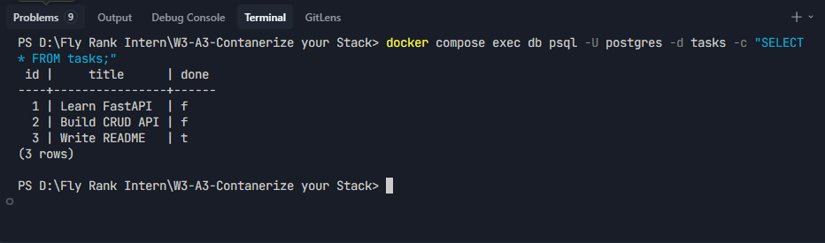
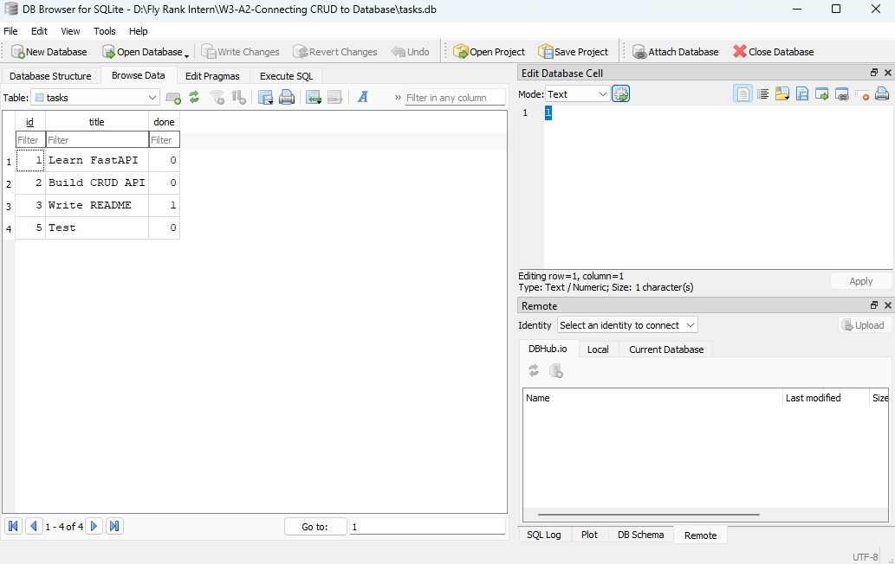

# Task CRUD API

A simple RESTful API built with **FastAPI** (Python) that manages a to‑do list.  
Supports full **CRUD** (Create, Read, Update, Delete) operations with proper HTTP status codes, input validation, and interactive documentation via **Swagger UI**.

This project was built as part of the **FlyRank AI Backend Internship – Week 2** assignment.

---

## ✨ Features

- ✅ **Create** a task – `POST /tasks` → returns `201 Created`
- 📖 **Read** all tasks – `GET /tasks` → returns `200 OK`
- 🔍 **Read** a single task – `GET /tasks/{id}` → returns `200` or `404`
- ✏️ **Update** a task – `PUT /tasks/{id}` → returns `200`, `400`, or `404`
- 🗑️ **Delete** a task – `DELETE /tasks/{id}` → returns `204 No Content`
- ✅ **Input validation** – missing/empty `title` returns `400 Bad Request`
- 📄 **Interactive Swagger UI** at `/docs` – test everything with a click
- 💾 **In‑memory storage** – data resets on server restart (database coming in Week 3!)

---

## 🛠️ Tech Stack

- **Python** 3.10+
- **FastAPI** – web framework
- **Uvicorn** – ASGI server
- **Pydantic** – data validation
- **Swagger UI** – built‑in API documentation

---

## 🚀 Installation & Run

### 1. Clone the repository
```bash
git clone https://github.com/your-username/todo-crud-api.git
cd todo-crud-api
```

### 2. Create a virtual environment (recommended)
```bash
python -m venv venv
source venv/bin/activate      # On Windows: venv\Scripts\activate
```

### 3. Install dependencies
```bash
pip install fastapi uvicorn
```

### 4. Start the server
```bash
uvicorn main:app --reload
```

The API will be available at:  
👉 **http://localhost:8000**  
Swagger UI at:  
👉 **http://localhost:8000/docs**

---

## 📋 Endpoints

| Method | Path           | Description                        | Success Status | Error Statuses          |
|--------|----------------|------------------------------------|----------------|--------------------------|
| GET    | `/`            | API information                    | 200            | –                        |
| GET    | `/health`      | Health check                       | 200            | –                        |
| GET    | `/tasks`       | List all tasks                     | 200            | –                        |
| GET    | `/tasks/{id}`  | Get a single task by ID            | 200            | 404 (not found)          |
| POST   | `/tasks`       | Create a new task                  | 201            | 400 (invalid title)      |
| PUT    | `/tasks/{id}`  | Update an existing task            | 200            | 400, 404                 |
| DELETE | `/tasks/{id}`  | Delete a task                      | 204            | 404 (not found)          |

---
## 🐳 Containerization (Docker & Postgres)

This project now runs entirely inside Docker containers using **Docker Compose**.

- **Why Postgres?** It's a production‑grade relational database that runs as its own server. FlyRank uses Postgres in production.
- **One‑command startup**: `docker compose up` starts both the FastAPI app and the PostgreSQL database.
- **Secrets**: The database password is stored in a `.env` file (git‑ignored). A template is provided in `.env.example`.
- **Persistence**: A named Docker volume (`taskdata`) keeps your data safe even when containers are stopped or removed.

### How to run (for a stranger)

```bash
# Clone the repo
git clone https://github.com/your-username/todo-crud-api.git
cd todo-crud-api

# Copy the environment template
cp .env.example .env

# Start everything
docker compose up --build
```

The API will be available at `http://localhost:8000`.  
Swagger UI at `http://localhost:8000/docs`.

### Database screenshot



### Example SQL query (Stage 4)

I ran this inside the Postgres container:

```sql
SELECT * FROM tasks;
```

It returned the tasks stored in the database, exactly matching what the API serves.
---

## 🗄️ Database

This project uses **SQLite** for persistent storage.

- **Why SQLite?** It’s serverless, zero‑configuration, and stores everything in a single file (`tasks.db`). Perfect for a small API where setup must be automatic.
- The database file is created **automatically** on the first run.
- The `tasks` table is created automatically if missing.
- Three example tasks are seeded **only once** – restarting the server does **not** duplicate them.
- All SQL queries use **parameterized placeholders** (`?`) to prevent SQL injection.

### DB Browser Screenshot



### Example SQL Query (Stage 4)

I ran:
```sql
SELECT * FROM tasks;
```
It returned all tasks currently stored in the database, matching what the API serves at /tasks.

---

## 🧪 Example Usage (curl)

### Create a task
```bash
curl.exe -i -X POST http://localhost:8000/tasks \
  -H "Content-Type: application/json" \
  -d "{\"title\": \"Learn FastAPI\"}"
```

**Expected response:**
```
HTTP/1.1 201 Created
...
{
  "id": 4,
  "title": "Learn FastAPI",
  "done": false
}
```

### Get all tasks
```bash
curl.exe -i http://localhost:8000/tasks
```

### Get a single task
```bash
curl.exe -i http://localhost:8000/tasks/1
```

### Update a task
```bash
curl.exe -i -X PUT http://localhost:8000/tasks/1 \
  -H "Content-Type: application/json" \
  -d "{\"done\": true}"
```

### Delete a task
```bash
curl.exe -i -X DELETE http://localhost:8000/tasks/1
```
*(returns 204 No Content with an empty body)*

---

## 🖥️ Swagger UI (Interactive Docs)

FastAPI automatically generates interactive API documentation.

1. Start the server.
2. Open your browser and go to:  
   **http://localhost:8000/docs**
3. You’ll see all endpoints listed with a **Try it out** button.
4. Click any endpoint, fill in the parameters, and send real requests – no `curl` needed!

---

## 📝 Notes

- **In‑memory storage** – all tasks are stored in a Python list. When the server restarts, the data resets to the three default examples. This is intentional – a real database (PostgreSQL, SQLite, etc.) will be introduced in **Week 3**.
- **Validation** – the server never trusts the client:
  - `title` must be provided and cannot be an empty string.
  - Missing/empty `title` in `POST` or `PUT` → `400 Bad Request` with a clear error message.
- **Status codes** follow REST best practices:
  - `201 Created` for successful POST.
  - `204 No Content` for successful DELETE.
  - `404 Not Found` for unknown IDs.
  - `400 Bad Request` for validation failures.

---

## 📂 Project Structure

```
.
├── main.py          # All API logic (routes, validation, storage)
├── README.md        # This file
└── screenshot.png   # Swagger UI screenshot
```

---

## 📬 Submission

This repository is public and contains **≥ 6 meaningful commits** (one per stage).  
A reviewer can clone, run, and test the full CRUD cycle in under 5 minutes using the instructions above.

---

## 👤 Author

**Muhammad Rizwan** – FlyRank AI Intern, Backend Track

---
